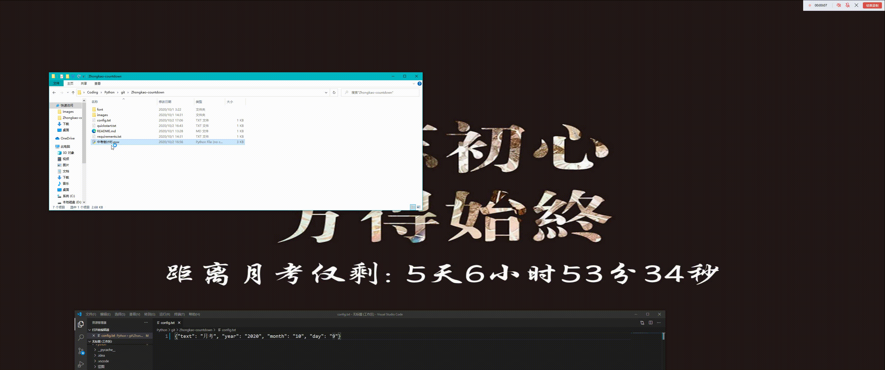

<!--
 * @Date: 2020-10-03 10:56:08
 * @LastEditors: lihaoze123
 * @LastEditTime: 2020-10-04 20:30:51
-->
# exam-countdown  

[![LICENSE][license]](./LICENSE)
[![Author][author]](https://github.com/lihaoze123) 
![GitHub stars][stars]
[![Python][lauguage]][2]
![Windows10][windows]    

   

<br>
这是个中考倒计时软件<br>

是为了提醒同学认真学习而开发的程序,运行也非常简单   
通过**cv2**更改图片, **datetime**获取剩余时间, 修改**Windows**系统注册表更改壁纸    

<br>  

## 如何安装  
参阅 [**quickstart.md**][1]    
或者安装完依赖的文件之后直接双击```中考倒计时.pyw```即可      

[1]: quickstart.md    
[2]: https://www.python.org     
[windows]: https://img.shields.io/badge/Windows-10-0078D6?logo=windows    
[lauguage]: https://img.shields.io/badge/Python-3.8.6-3776AB?logo=python    
[实现效果]: examples/实现效果.gif    
[stars]: https://img.shields.io/github/stars/lihaoze123/exam-countdown?logo=github&color=red     
[author]: https://img.shields.io/badge/Author-lihaoze-brightgreen?logo=github
[license]: https://img.shields.io/github/license/lihaoze123/exam-countdown?logo=
